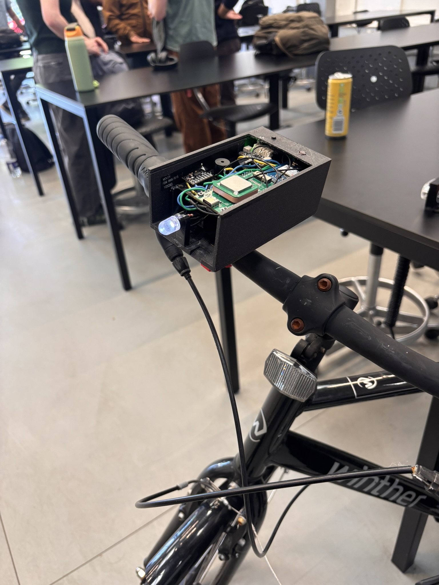

<!--
# iot-bling-bling
To compile and execute the code, the following libraries are required:
Accelerometer: https://github.com/DFRobot/DFRobot_ADXL345/tree/main 
#include "Adafruit_MAX1704X.h"
-->


<a id="readme-top"></a>


<!-- PROJECT SHIELDS 
[![Contributors][contributors-shield]][contributors-url]
[![Forks][forks-shield]][forks-url]
[![Stargazers][stars-shield]][stars-url]
[![Issues][issues-shield]][issues-url]
[![Unlicense License][license-shield]][license-url]
[![LinkedIn][linkedin-shield]][linkedin-url]
-->


<!-- PROJECT LOGO -->
<br />
<div align="center">
  <a href="https://github.com/immarianaas/iot-bling-bling/">
    
  </a>

  <h3 align="center">Smart Bike Light</h3>

  <p align="center">


  Final project of the <a href="https://lifelonglearning.dtu.dk/en/electro/single-course/networking-technologies-and-application-development-for-internet-of-things-iot/">[34346] Networking technologies and application development for IoT</a> course, lectured at Technical University of Denmark, in the academic year of 2024/2025.

  </p>
</div>


<!-- TABLE OF CONTENTS -->
<details>
  <summary>Table of Contents</summary>
  <ol>
    <li>
      <a href="#Introduction">About The Project</a>
      <ul>
        <li><a href="#built-with">Built With</a></li>
      </ul>
    </li>
    <li><a href="#repository-organisation">Repository Organisation</a></li>
    <li><a href="#getting-started">Getting Started</a></li>
    <li><a href="#pictures">Pictures</a></li>
    <li><a href="#acknowledgments">Acknowledgments</a></li>
  </ol>
</details>


<!-- ABOUT THE PROJECT -->
## Introduction

In Denmark, cycling is a popular form of transportation across all age groups. However, school-aged children faces the issue of forgetting to turn on their bike light or charge the bike light. This is a huge safety and security issue. In Denmark, it is estimated that 2200 accidents could be avoided if these bike lights were automated and more reliable. In addition, bikes disappearance and theft are also huge issues. Bike theft alone costs Danes 250 million DKK anually, which means that the need for integrated geolocation is crucial.

To address these issues, the project aims to develop a Smart Bike Light that will improve safety for both cyclists and everyone else on the road. The Smart Bike Light combines automatic light activation and deactivation, monitoring of battery status as well as geolocation tracking, all enclosed in a custom 3D-printed case. 

Users are able to obtain these real-time data remotely through a mobile application, such as the location of the bike and the status of the battery. This will be possible with the use of LoRaWAN. By combining these features, the bike light aims to reduce accidents, discourage theft and enhance the overall biking experience. 


<p align="right">(<a href="#readme-top">back to top</a>)</p>


### Built With
<a id="built-with"></a>


[![Arduino][arduino-shield]][arduino-url] [![Heltec][heltec-shield]][heltec-url]

Additional libraries:

[![Accelerometer][accelerometer-shield]][accelerometer-url] [![GPS][gps-shield]][gps-url] [![Battery][battery-shield]][battery-url]

Related to the mobile application and integration:

[![Cibicom][cibicom-shield]][cibicom-url] [![Python][python-shield]][python-url] [![Flask][flask-shield]][flask-url] [![SwiftUI][swiftui-shield]][swiftui-url]

<p align="right">(<a href="#readme-top">back to top</a>)</p>

## Repository Organisation

A non-comprehensive overview of this repository is shown below.

```bash
iot-bling-bling/
├── esp32/                  # ESP32 code to handle specific modules
├── heltec/                 # Code for the Heltec board
|   └── lorawan_integrate/  # Top level of the uploaded code
|   └── (...)
├── mobile_app/             # Code related to the app
│   └── IoTBikeLight/       # Front-end code
│   └── IoTServer/          # Back-end code
├── my_lorawan_lib/         # Code for the libraries we developed
│   └── my_battery.h/.cpp   # Library to handle interaction with battery module
│   └── my_gps.h/.cpp       # Library to handle interaction with GNSS/GPS module
│   └── my_light_control.h/.cpp       # Library to handle light control processes
│   └── my_lorawan.h/.cpp   # Library to handle LoraWAN related processes
│   └── my_wifi_location.h/.cpp   # Library to handle interaction with WiFi
├── report.pdf              # The report
├── presentation.pdf        # The project presentation
├── project_description.pdf # The initial project description
├── README.md               # This document
```

`heltec/lorawan_integrate/` contains the `.ino` file that is programmed into the Heltec board. The `my_lorawan_lib` directory contains C++ library files that we created to keep our code organised.

<p align="right">(<a href="#readme-top">back to top</a>)</p>

<!-- GETTING STARTED -->
## Getting Started

Assuming the hardware is setup correctly (more information about it on the report), a few steps are needed before the code in `heltec/lorawan_integrate/` can be uploaded to the board. Two steps need to be taken:
1. The additional libraries mentioned in the <a href="#readme-top">Built With</a> section need to be installed.
2. The `my_lorawan_lib` folder needs to be placed in the default library folder used by Arduino IDE. This can be done, for example, with a *simlink*. The file `my_lorawan_lib/README.md` explains how this can be done.

Finally, the file `heltec/lorawan_integrate/lorawan_integrate.ino` can just be uploaded to the Heltec board.

<p align="right">(<a href="#readme-top">back to top</a>)</p>

<!-- USAGE EXAMPLES -->
## Pictures





<p align="right">(<a href="#readme-top">back to top</a>)</p>

<!-- ACKNOWLEDGMENTS -->
<h2 id="acknowledgments">Acknowledgments</h2>

[DTU - Danmarks Tekniske Universitet](https://www.dtu.dk/)


<p align="right">(<a href="#readme-top">back to top</a>)</p>


<!-- MARKDOWN LINKS & IMAGES -->
<!-- https://www.markdownguide.org/basic-syntax/#reference-style-links -->


[arduino-shield]: https://img.shields.io/badge/arduino-34ABB0?style=for-the-badge&logo=arduino
[arduino-url]: https://www.arduino.cc/
[heltec-shield]: https://img.shields.io/badge/heltec%20esp32c3%20+%20sx1262-D3D4BE?style=for-the-badge&logo=esp32
[heltec-url]: https://heltec.org/project/ht-ct62/
[accelerometer-shield]: https://img.shields.io/badge/DFRobot__ADXL345-39393B?style=for-the-badge&logo=esp32
[accelerometer-url]: https://github.com/DFRobot/DFRobot_ADXL345
[battery-shield]: https://img.shields.io/badge/Adafruit__MAX1704X-39393B?style=for-the-badge&logo=esp32
[battery-url]: https://github.com/adafruit/Adafruit_MAX1704X
[gps-shield]: https://img.shields.io/badge/TinyGPS++-39393B?style=for-the-badge&logo=esp32
[gps-url]: https://github.com/mikalhart/TinyGPSPlus

[python-shield]: https://img.shields.io/badge/Python-F5C93C?style=for-the-badge&logo=python
[python-url]:https://www.python.org/
[flask-shield]: https://img.shields.io/badge/flask-2A647D?style=for-the-badge&logo=flask
[flask-url]: https://flask.palletsprojects.com/en/stable/
[cibicom-shield]: https://img.shields.io/badge/cibicom-153051?style=for-the-badge&logo=cibicom
[cibicom-url]: https://cibicom.dk/
[swiftui-shield]: https://img.shields.io/badge/swiftui-0071F5?style=for-the-badge&logo=swift
[swiftui-url]: https://developer.apple.com/xcode/swiftui/